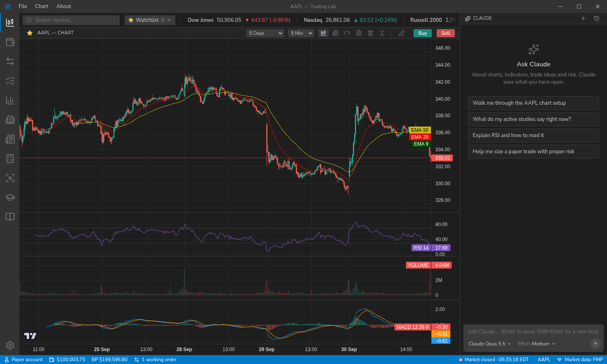
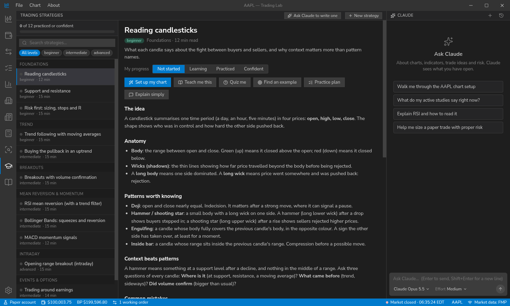

# Trading Lab

A desktop app for **learning to trade with paper money**. It combines live-data charts, a simulated brokerage account, research screens, a trading journal and a strategy library, with a **Claude** assistant that can read the same screens you see and teach from them.

> Educational software. Nothing in it is investment advice. Trades are simulated, with no real money and no brokerage connection.



## What you get

**Charts and trading practice**
- Candlestick, hollow, bar, line, area and Heikin Ashi charts on TradingView's open-source [Lightweight Charts](https://github.com/tradingview/lightweight-charts), from 1-minute to monthly bars.
- 23 studies (moving averages, Bollinger, Ichimoku, Supertrend, RSI, MACD, ADX, VWAP, pivots and more) with editable parameters and **per-line colors**.
- Drawing tools: trendlines, rays, horizontal lines, Fibonacci retracements, rectangles.
- **Several paper accounts**, each with a name, brokerage, link and balance you can set to mirror your real accounts (cash or margin), and a Think-or-Swim-style order ticket: market, limit, stop, stop-limit and trailing-stop orders, brackets and OCO. Draft and working orders appear as draggable lines on the chart. Fills are simulated from real 1-minute bars.
- A **position calculator** that sizes trades from risk, capped by your own limits (max risk per trade, per position and total invested), using live price and ATR.
- A **trading journal** that records the plan, the reasoning and the real outcome (computed from your fills), with a review section.

**Research screens** (Financial Modeling Prep data). The app checks which data your FMP plan includes and hides the screens, chart intervals and Claude tools it does not, instead of showing errors.
- Quote details, analyst ratings and targets, fundamentals, news, delayed **options chains** (Cboe), market performance by sector and industry, a **stock screener**, market and symbol news, and Senate and House trade disclosures.
- Multiple watchlists, with live prices.

**Learning**
- A **strategy library** of 13 documents (candlesticks, a gallery of 41 candlestick patterns, support and resistance, risk, trend following, pullbacks, breakouts, RSI, Bollinger, MACD, opening range, earnings, options) with rules, mistakes, practice and self-check questions. One click sets your chart up for a strategy.
- Progress tracking per strategy.

**Claude assistant** (right-hand panel)
- Choose the model and the effort level.
- 46 tools: read the chart, candles, study values and swing points; add studies; draw on the chart; read the account, journal, watchlists, news, screener, options, analyst data and the strategy library; set up an order ticket; write journal entries and strategy documents; and more.
- **Claude can prepare an order ticket but can never send, cancel or change an order.** You review and send every trade.



## Help

A full **Help library** is built in: 41 pages with screenshots and step-by-step instructions for every screen and feature, from first-time setup to reference material. Open it from **About → Help Contents** or press **F1**. The pages are Markdown files in `src/renderer/src/help/pages/`.

## Requirements

- **Linux.** Developed on Raspberry Pi OS (arm64) and also built and run on x86-64 (Debian 13): the unpacked build and the AppImage pass `--self-test` there. The x86-64 `.deb` builds with the right metadata but has not been installed.
- **Node.js 22 or newer** and npm (to run from source). Electron 44 bundles its own Node 24, so end users of the packaged app need neither.
- A **[Financial Modeling Prep](https://site.financialmodelingprep.com/) API key.** Without one the app runs on sample data, and trading is disabled because simulated fills need real prices. Intraday history and some endpoints need a paid plan. Options data does not use FMP.
- An **[Anthropic API key](https://console.anthropic.com/)** for the Claude panel (optional; everything else works without it).
- A running secret service (gnome-keyring or KWallet) so keys can be stored encrypted. Without one, Settings says the keys are stored unencrypted.

## Run it

```bash
npm install
npm run dev          # development, with hot reload
```

Then open **File → Settings** and paste your FMP and Anthropic keys.

> If you launch from VS Code's terminal, that terminal sets `ELECTRON_RUN_AS_NODE`, which makes Electron start as plain Node. The npm scripts already unset it; if you run Electron yourself, use `env -u ELECTRON_RUN_AS_NODE`.

### Build an installable app

```bash
npm run dist         # AppImage and .deb in ./release (about 90 seconds)
npm run dist:dir     # just the unpacked folder: release/linux-unpacked/trading-lab (linux-arm64-unpacked on arm64)
```

- AppImage: `chmod +x release/Trading-Lab-*.AppImage && ./release/Trading-Lab-*.AppImage`
- Debian: `sudo apt install ./release/trading-lab_*.deb` (adds a menu entry and a `trading-lab` command)

### Check an install

```bash
./trading-lab --self-test                         # prints versions, data folder, database and key status; opens no window
./trading-lab --screenshot=/tmp/shot.png --view="Stock Screener"   # saves a picture of a screen
```

## Your data and privacy

- Everything lives in **`~/.config/trading-lab`**: a SQLite database (`trading.db`) with the paper accounts, orders, journal, watchlists, strategy progress, settings, and a cache of market data. The dev build, the AppImage and the `.deb` all share this folder.
- API keys are stored encrypted through the system keyring when it is available.
- Set `TRADING_DATA_DIR` to use a different folder (handy for testing).
- Network use: `financialmodelingprep.com` (market data and its MCP server), `cdn.cboe.com` (delayed options), `api.anthropic.com` (the assistant), and publishers' image servers for news thumbnails. Your FMP key is only ever sent to FMP; Claude's tool calls run inside the app.
- When you chat, the message, the app context (symbol, chart settings, account summary) and any tool results Claude requests are sent to Anthropic.

## Troubleshooting

| Problem | Fix |
|---|---|
| App exits at start-up from a plain folder or AppImage | Packaged builds already disable Chromium's sandbox (it needs a root-owned helper or user namespaces). Set `TRADING_SANDBOX=1` to keep it where it works. |
| Settings says keys are stored unencrypted | Start your keyring (gnome-keyring) and re-save the keys. The app asks for the libsecret store explicitly because some desktops are not detected. |
| Blank or flickering window on some GPUs | `TRADING_NO_GPU=1 trading-lab` |
| Market data screens show "sample data" | Add your FMP key in Settings, then use **Test connection** to see which endpoints your plan can reach. |

## Limits worth knowing

- Paper fills come from 1-minute bars: no partial fills, commissions, slippage, extended hours or market holidays.
- Congressional trades are disclosed late (up to 45 days) and as dollar ranges, so they are history, not a signal.
- There is no live-brokerage connection. See [CLAUDE.md](CLAUDE.md) for the design constraints any future one must respect.

## Project layout

```
src/main/       Electron main process: window, SQLite, FMP client and cache, paper-trading engine,
                journal, strategies, watchlists, options feed, the Claude chat loop
src/preload/    the typed bridge exposed to the UI (window.api)
src/renderer/   React UI: screens (views/), components, chart code, Claude's tool handlers (chart/tools.ts)
src/shared/     pure code used by both sides: types, order analysis, position sizing, options math,
                the list of Claude tools and the system prompt
build/          app icon          docs/   screenshots
```

Architecture notes, conventions and gotchas for contributors (and for Claude Code) are in [CLAUDE.md](CLAUDE.md).

## License

No license yet: all rights reserved for now. The code is public to read, but it is not licensed for reuse.
